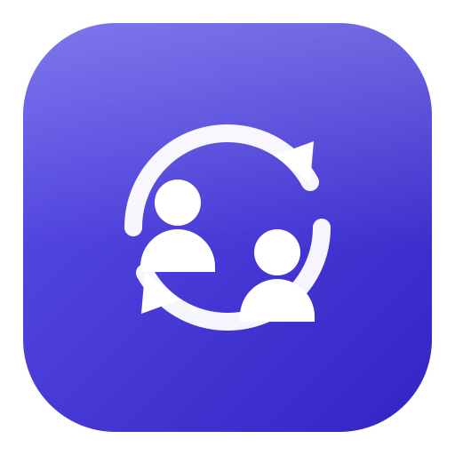
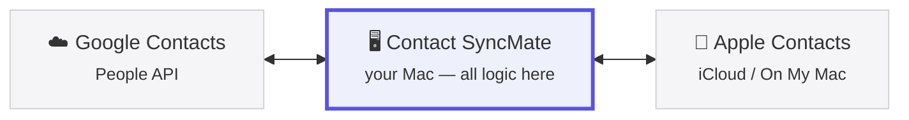
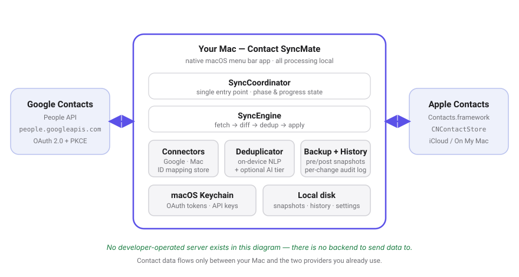
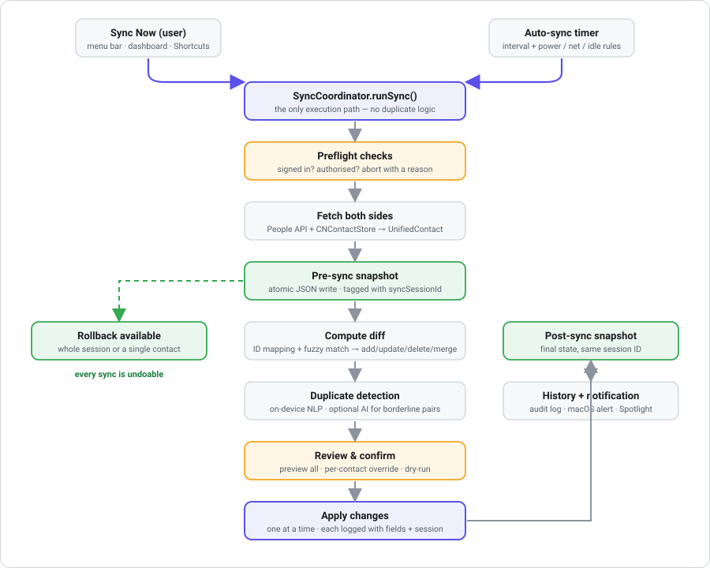
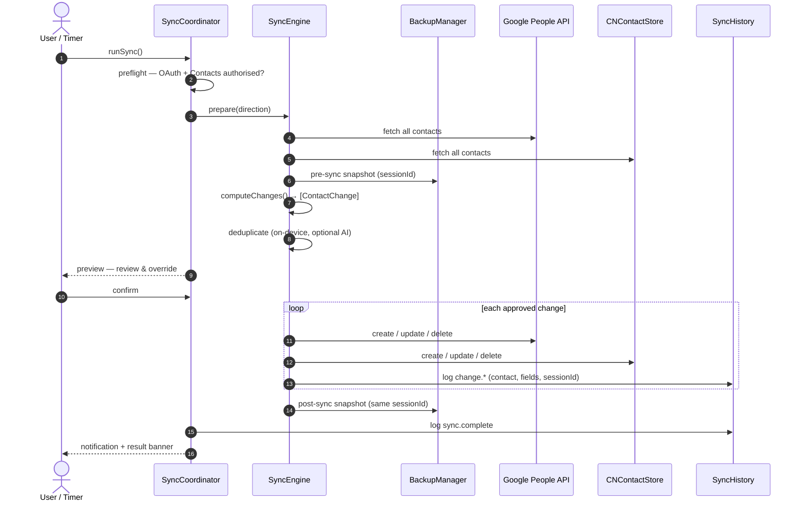
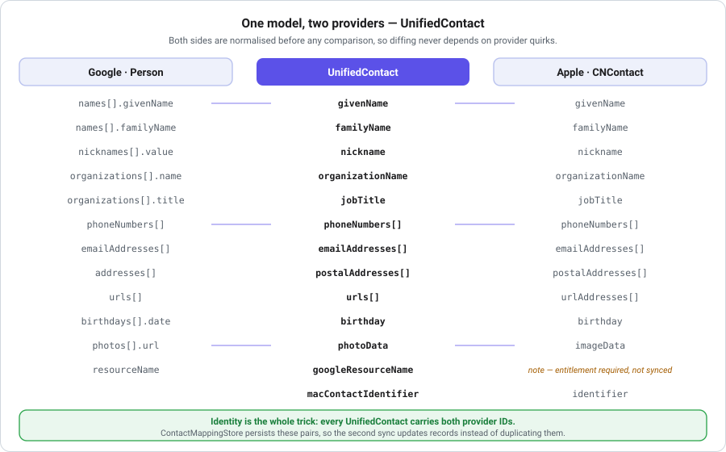
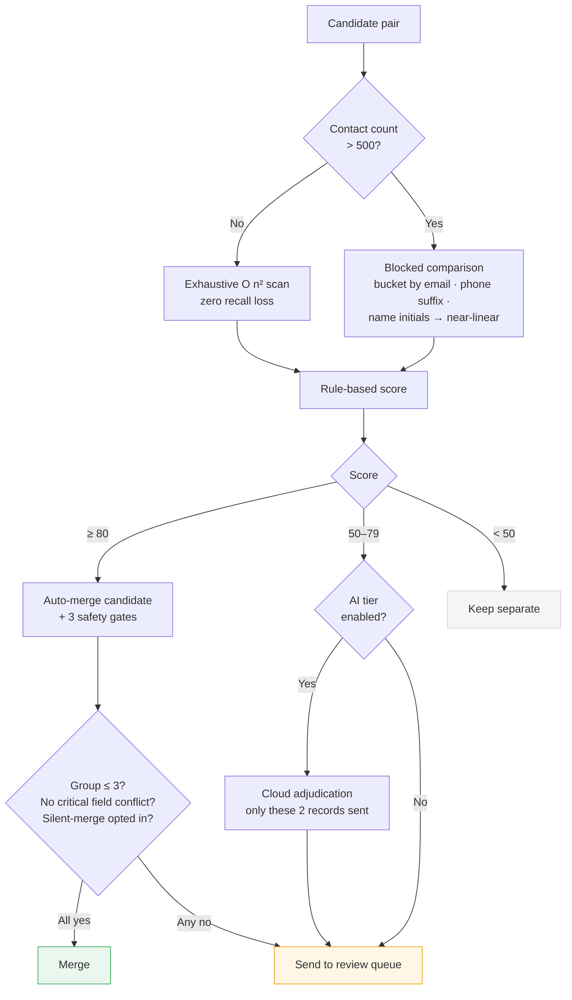
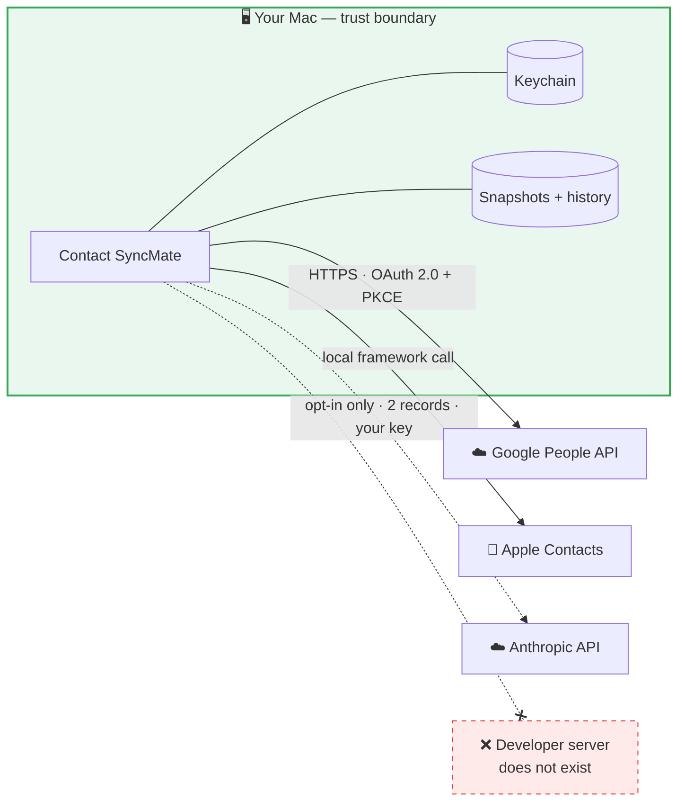

<div align="center">



# Contact SyncMate

**Two-way contact synchronisation between Google Contacts and Apple Contacts — on your Mac.**

[](https://www.apple.com/macos/)
[](https://swift.org)
[](https://developer.apple.com/xcode/swiftui/)
[](#testing)
[](#privacy-architecture)
[](#privacy-architecture)

[Website](https://mingmanhk.github.io/Contact-SyncMate/) ·
[Privacy Policy](https://mingmanhk.github.io/Contact-SyncMate/privacy.html) ·
[Terms](https://mingmanhk.github.io/Contact-SyncMate/terms.html) ·
[Issues](https://github.com/mingmanhk/Contact-SyncMate/issues)

</div>

---

## Table of contents

- [The concept](#the-concept)
- [Why two-way sync is hard](#why-two-way-sync-is-hard)
- [System architecture](#system-architecture)
- [The sync pipeline](#the-sync-pipeline)
- [Data model & field mapping](#data-model--field-mapping)
- [File formats](#file-formats)
- [Contact matching model](#contact-matching-model)
- [Design decisions](#design-decisions)
- [Privacy architecture](#privacy-architecture)
- [Feature matrix](#feature-matrix)
- [Permissions & entitlements](#permissions--entitlements)
- [Setup](#setup)
- [Build](#build)
- [Testing](#testing)
- [Project structure](#project-structure)
- [Design system](#design-system)
- [Troubleshooting](#troubleshooting)
- [Known limitations](#known-limitations)
- [Roadmap](#roadmap)
- [Contributing](#contributing)
- [License](#license)

---

## The concept

Most people's address book lives in **two** places at once:

| Ecosystem | Typically used for | Reached via |
|---|---|---|
| **Google Contacts** | Gmail, Android, Google Workspace | Google People API (OAuth 2.0) |
| **Apple Contacts** | Mac, iPhone, iPad, Apple Mail | `Contacts.framework` / `CNContactStore` |

Neither vendor offers true bidirectional reconciliation with the other. macOS can
*subscribe* to a Google account read-only, and Google can *import* a vCard once —
but neither keeps the two lists genuinely in step.

**Contact SyncMate is a reconciliation engine, not an importer.** It maintains a
persistent identity mapping between the two address books, computes what actually
changed on each side since the last run, merges field-level differences, and
recognises the same human under different spellings.



> **No server exists in this diagram.** There is no Contact SyncMate backend, no
> account to create, and no path by which the developer could receive your data.

---

## Why two-way sync is hard

Naïve syncing breaks in five predictable ways. Each drove a design decision:

<table>
<thead>
<tr><th width="22%">Problem</th><th width="39%">What goes wrong naïvely</th><th width="39%">How Contact SyncMate handles it</th></tr>
</thead>
<tbody>
<tr>
  <td><strong>Identity</strong></td>
  <td>Re-importing creates a second copy of everyone, because Google resource names and <code>CNContact</code> identifiers are unrelated.</td>
  <td>A persistent <code>ContactMappingStore</code> records each Google ↔ Mac pairing, so the second run updates instead of duplicating.</td>
</tr>
<tr>
  <td><strong>Change detection</strong></td>
  <td>Blind overwrite silently discards whichever side you didn't pick as master.</td>
  <td>Timestamps are compared against the last-sync marker per mapping; only genuinely changed records move.</td>
</tr>
<tr>
  <td><strong>Simultaneous edits</strong></td>
  <td>Both sides changed → last writer wins → data loss.</td>
  <td>Classified as a <em>conflict</em>. Resolved by field-level merge, by a configured preference, or by asking you.</td>
</tr>
<tr>
  <td><strong>Fuzzy identity</strong></td>
  <td>"Bob Smith" and "Robert Smith" stay forever separate.</td>
  <td>Multi-signal on-device matcher (nicknames, initials, transposition, phonetics, phone suffix, email aliases) with a confidence score.</td>
</tr>
<tr>
  <td><strong>Irreversibility</strong></td>
  <td>A bad sync destroys an address book with no undo.</td>
  <td>Atomic snapshots before <em>and</em> after every sync, plus a per-change audit log, make any run reversible.</td>
</tr>
</tbody>
</table>

---

## System architecture

<div align="center">

</div>

Strict layering — each layer may only call downward:

```mermaid
flowchart TD
    subgraph V["🎨 Views — stateless SwiftUI"]
        V1[MenuBarView]
        V2[DashboardView]
        V3[SettingsView]
        V4[SyncPreviewView]
    end
    subgraph C["🎯 Coordination — the only sync entry point"]
        C1[SyncCoordinator<br/>@MainActor · publishes phase & progress]
    end
    subgraph E["⚙️ Domain"]
        E1[SyncEngine<br/>fetch → diff → apply]
        E2[ContactDeduplicator]
        E3[NameFormattingEngine]
        E4[ContactNormalizer]
    end
    subgraph S["🔌 Services"]
        S1[GoogleContactsConnector]
        S2[MacContactsConnector]
        S3[ContactMappingStore]
        S4[ContactBackupManager]
        S5[SyncHistory]
        S6[KeychainStore]
        S7[GoogleOAuthManager]
    end
    subgraph P["💾 Persistence"]
        P1[(macOS Keychain<br/>tokens · API keys)]
        P2[(Local disk<br/>snapshots · history)]
        P3[(UserDefaults<br/>preferences)]
    end

    V --> C
    C --> E
    E --> S
    S --> P

    style C fill:#eef1fb,stroke:#5B51E8,stroke-width:2px
    style P fill:#eaf7ee,stroke:#34a853
```

**Key invariant — one sync path.** `SyncCoordinator.runSync()` is the *only*
function that instantiates `SyncEngine`. The menu bar button, the dashboard
button, the auto-sync timer, and the Shortcuts action all funnel through it.
Progress state, history, notifications, and the menu bar icon therefore can never
disagree, and two syncs can never overlap.

---

## The sync pipeline

<div align="center">

</div>



<details>
<summary><strong>Change classification rules</strong> — how each contact is categorised</summary>

<br>

| Situation | Two-way | Google → Mac | Mac → Google |
|---|---|---|---|
| Exists in Google only, unmapped | **Add** to Mac | **Add** to Mac | Skip |
| Exists in Mac only, unmapped | **Add** to Google | Skip | **Add** to Google |
| Mapped; Google newer | **Update** Mac | **Update** Mac | Skip |
| Mapped; Mac newer | **Update** Google | Skip | **Update** Google |
| Mapped; **both** changed since last sync | **Merge** (conflict) | Update Mac | Update Google |
| Mapped; neither changed | Skip | Skip | Skip |
| Mapped; deleted on one side | **Delete** other side¹ | Delete Mac¹ | Delete Google¹ |
| Unmapped but fuzzy-matched | **Merge** + create mapping | Merge | Merge |

¹ Only when *Sync deleted contacts* is enabled. Each deletion is confirmed
individually unless you disable that safeguard.

**Conflict resolution options:** `Always Ask` (default) · `Prefer Google` ·
`Prefer Mac` — with per-contact override always available in the preview sheet.

</details>

---

## Data model & field mapping

Google's `Person` and Apple's `CNContact` disagree about almost everything —
nesting, cardinality, label vocabulary, date representation. Diffing them
directly would mean encoding provider quirks into the comparison logic. Instead
both sides are normalised into one `UnifiedContact` **before** any comparison
happens.

<div align="center">

</div>

### Field mapping

| Google `Person` | `UnifiedContact` | Apple `CNContact` | Synced |
|---|---|---|:--:|
| `names[].givenName` | `givenName` | `givenName` | ✅ always |
| `names[].middleName` | `middleName` | `middleName` | ✅ always |
| `names[].familyName` | `familyName` | `familyName` | ✅ always |
| `names[].honorificPrefix` | `namePrefix` | `namePrefix` | ✅ always |
| `names[].honorificSuffix` | `nameSuffix` | `nameSuffix` | ✅ always |
| `nicknames[].value` | `nickname` | `nickname` | ✅ always |
| `organizations[].name` | `organizationName` | `organizationName` | ⚙️ toggle |
| `organizations[].title` | `jobTitle` | `jobTitle` | ⚙️ toggle |
| `phoneNumbers[]` | `phoneNumbers[]` | `phoneNumbers[]` | ✅ always |
| `emailAddresses[]` | `emailAddresses[]` | `emailAddresses[]` | ✅ always |
| `addresses[]` | `postalAddresses[]` | `postalAddresses[]` | ⚙️ toggle |
| `urls[]` | `urls[]` | `urlAddresses[]` | ⚙️ toggle |
| `birthdays[].date` | `birthday` | `birthday` | ⚙️ toggle |
| `photos[].url` | `photoData` | `imageData` | ⚙️ toggle |
| `biographies[].value` | `note` | `note` | ❌ entitlement |
| `resourceName` | `googleResourceName` | — | 🔑 identity |
| — | `macContactIdentifier` | `identifier` | 🔑 identity |
| `metadata.sources[].updateTime` | `lastModified` | *derived* | 🕐 change detection |

**Identity is the whole trick.** Every `UnifiedContact` carries *both* provider
IDs. `ContactMappingStore` persists those pairs, which is what turns the second
sync into an update rather than a duplicate.

### Normalisation applied before comparison

| Data | Normalisation | Why |
|---|---|---|
| Phone | strip formatting; compare last 7+ digits | `+1 (415) 555-0100` ≡ `4155550100` |
| Email | lower-case; strip `+alias` when matching | `John+Work@X.com` ≡ `john@x.com` |
| Name | case-fold, trim, collapse whitespace, strip diacritics for matching only | `josé` matches `Jose` without rewriting the stored value |
| Postal country | optional ISO country-code normalisation | `USA` / `United States` / `US` stop looking like edits |
| Casing | **opt-in** Title Case / UPPER / lower at write time | never applied unless you turn it on |

Comparison is case-insensitive, so enabling name formatting does **not** produce
a storm of spurious "changed" records.

---

## File formats

| Format | Direction | Where | Purpose |
|---|---|---|---|
| **JSON** — backup snapshot | write + read | backup folder | The app's own restore format. One file per session, plus `backup_index.json`. Written atomically. Contains full `UnifiedContact` records for both sides, `syncSessionId`, timestamps, and per-contact version entries. |
| **JSON** — sync history | write + read | `~/Library/Application Support/<bundle-id>/sync_history.json` | Append-only audit log of events, pruned by age and count. |
| **JSON** — dedup decisions | write + read | Application Support | Remembers "keep separate" patterns so a pair is not re-raised. |
| **JSON** — OAuth config | read | app bundle | `clientId`, `clientSecret`, `redirectURI`. Secret is migrated to Keychain on first launch. |
| **CSV** (`UTType.commaSeparatedText`) | export | folder you pick | Spreadsheet-friendly export of either address book. UTF-8, header row, one contact per row, multi-value fields joined. |
| **XLSX** | export | folder you pick | Same content as CSV in a native Excel workbook. |

<details>
<summary><strong>Backup snapshot structure</strong></summary>

<br>

```jsonc
{
  "id": "UUID",                     // this snapshot
  "timestamp": "2026-07-26T09:15:00Z",
  "syncSessionId": "UUID",          // ← links pre-sync and post-sync pairs
  "type": "preSync",                // preSync | postSync | manual | auto
  "googleContactsCount": 412,
  "macContactsCount": 398,
  "contactVersions": [
    {
      "id": "UUID",
      "contactName": "Jane Doe",
      "source": "google",           // google | mac | merged
      "versionNumber": 3,
      "timestamp": "2026-07-26T09:15:00Z",
      "changesSummary": ["Phone changed", "Job title changed"],
      "data": { /* full UnifiedContact */ }
    }
  ],
  "metadata": {
    "appVersion": "1.1",
    "syncDirection": "twoWay",
    "syncMode": "manual",
    "customNotes": "…"
  }
}
```

Because pre-sync and post-sync snapshots share a `syncSessionId`, a single sync
can be reconstructed — and reversed — from either end.

</details>

<details>
<summary><strong>CSV / XLSX column layout</strong></summary>

<br>

| Column | Contents |
|---|---|
| `Given Name`, `Middle Name`, `Family Name` | Name components |
| `Name Prefix`, `Name Suffix`, `Nickname` | Honorifics and nickname |
| `Organization`, `Job Title` | Work |
| `Phone 1…n` | Each with its label, e.g. `mobile: +1 415 555 0100` |
| `Email 1…n` | Each with its label |
| `Address 1…n` | Street, city, state, postcode, country |
| `Website 1…n` | URLs |
| `Birthday` | ISO 8601 date |
| `Source` | `google` or `mac` |
| `Identifier` | Provider ID, for cross-referencing |

Exports are a **one-way archive format** — the app does not re-import CSV or
XLSX. Use a backup snapshot to restore.

</details>

> **No vCard (.vcf) support.** Both providers already export vCard, and adding a
> third round-trip format would multiply the field-fidelity edge cases without
> improving the core sync. Backups use JSON precisely because it round-trips
> `UnifiedContact` losslessly.

---

## Contact matching model

Two records are scored, then routed by confidence. Scoring is deterministic and
runs on-device.



### Scoring signals

| Signal | Weight | Example |
|---|:--:|---|
| Exact email match | **+60** | `a@x.com` on both records |
| Exact phone match | **+60** | `+1 555 0100` ≡ `5550100` |
| Exact full-name match | **+30** | `John Smith` ≡ `John Smith` |
| Similar name (nickname / initial / phonetic / transposed) | **+20** | `Bob Smith` ≈ `Robert Smith` |
| Organisation match | **+10** | both `Acme Inc` |
| Address match | **+10** | same street + city |
| Email **domain mismatch** | **−10** | two different `John Smith`s at different firms |
| Contradictory contact info | **−20** | no overlapping email *or* phone |

### On-device matching signals

| Signal | Recognises |
|---|---|
| Nickname dictionary | Bob ↔ Robert · Liz ↔ Elizabeth · Bill ↔ William |
| Initial abbreviation | `J. Smith` ↔ `John Smith` |
| Transposed name order | `Wei Li` ↔ `Li Wei` |
| Soundex phonetics | `Schmidt` ↔ `Schmitt` |
| Phone suffix | `+1 415 555 0100` ↔ `555-0100` |
| Email plus-alias | `john+work@x.com` ↔ `john@x.com` |
| Compound names | `Liwei Zhang` ↔ `Li Wei Zhang` |
| Stored nickname field | the contact's own Nickname |

> **Decision memory.** A pair you mark *keep separate* is remembered as a pattern
> and never raised again.

<details>
<summary><strong>Optional cloud AI tier</strong> — how it is bounded</summary>

<br>

Disabled by default. When you supply **your own** Anthropic API key *and*
switch on the explicit consent toggle in Settings → AI Matching (the key alone
does not enable cloud calls):

| Property | Value |
|---|---|
| When invoked | Only for pairs scoring inside your configured band (default 30–79) |
| Model | Your choice: Claude Haiku (default) · Sonnet · Opus |
| Data sent | Only the **two records being compared** — never your address book |
| Key storage | macOS Keychain |
| Developer involvement | None — the call goes from your Mac to Anthropic under your account |
| Caching | Content-fingerprinted, so editing a contact invalidates stale verdicts; cleared after each scan |
| Offline | Silently skipped; on-device matching still runs |

</details>

---

## Design decisions

The non-obvious choices, and what each one is defending against.

<details open>
<summary><strong>One sync path, enforced</strong></summary>

<br>

`SyncCoordinator.runSync()` is the only function permitted to construct
`SyncEngine`. The menu bar button, the dashboard button, the auto-sync timer and
the Shortcuts action all call it.

*Defends against:* an earlier version had the auto-sync timer build its own
engine. `AppState.isSyncing` was then only updated by the coordinator path, so a
background sync ran completely invisibly — no progress, no icon change, and a
manual sync could start on top of it. Collapsing to one path made that class of
bug unrepresentable.

</details>

<details>
<summary><strong>Snapshots before <em>and</em> after, sharing a session ID</strong></summary>

<br>

Two snapshots per sync costs disk but buys a property nothing else gives: any
sync can be reconstructed from either end, and "what exactly did that run change?"
is answerable months later.

*Defends against:* the classic sync horror story — a bad run silently mangles an
address book and there is no before-state to compare against.

</details>

<details>
<summary><strong>Blocking above 500 contacts, exhaustive below</strong></summary>

<br>

Pairwise duplicate comparison is O(n²). At 5,000 contacts that is 12.5 M
comparisons. Above 500 contacts the app buckets candidates by email, phone
suffix, and name initials, and only scores pairs sharing a bucket.

*Trade-off, stated openly:* at that scale a pair sharing **only** a transposed
name — no email, no phone — may not become a candidate. Below 500 the exhaustive
scan runs and there is no recall loss at all. Documented in `DedupBlockingTests`.

</details>

<details>
<summary><strong>Never call <code>CNContactStore</code> from the main actor</strong></summary>

<br>

`CNContactStore` calls are synchronous XPC to `contactsd`, which runs at
background QoS. Calling them from a `@MainActor` context makes a
user-interactive thread wait on a background one — a priority inversion, which
macOS reports as a hang risk and users experience as a beachball.

Every call site uses `Task.detached(priority: .userInitiated)` and hops back to
the main actor only to publish results.

</details>

<details>
<summary><strong>Security-scoped bookmarks, not paths</strong></summary>

<br>

Under the App Sandbox, the folder access granted by `NSOpenPanel` is revoked
when the process exits. Storing `url.path` produces an app that backs up
perfectly until the user quits, then silently fails forever.

`SecurityScopedBookmark` persists the grant, refreshes stale bookmarks when a
folder moves, and balances `startAccessing`/`stopAccessing` automatically.

</details>

<details>
<summary><strong>Degrade loudly, never silently</strong></summary>

<br>

Apple declined the Contacts-notes entitlement. Without it, `CNContactNoteKey`
returns empty strings and writes are dropped on the floor — with no error.

Rather than appear to sync notes, `MacContactsConnector.notesFieldAvailable` is
`false`, `AppSettings.syncNotes` is forced off regardless of stored value, and
the Settings toggle is disabled with an explanatory footer. The same principle
applies to the optional cloud AI tier: no key means on-device matching only, and
the UI says so.

</details>

<details>
<summary><strong>Semantic colour tokens, no literals</strong></summary>

<br>

Every colour resolves through an asset-catalog colour set with paired light and
dark values. No view contains `Color.red`.

*Defends against:* SwiftUI's `.green` is a fluorescent hue in dark mode that
overpowers the surface, and `Color.secondary.opacity(0.1)` — a common ad-hoc
"card background" — is nearly invisible against `windowBackgroundColor` in one
mode or the other. Both bugs were present before the token system landed.

</details>

<details>
<summary><strong>Tests pin the settings they depend on</strong></summary>

<br>

The app and the test bundle share a `UserDefaults` domain. A diff test that
depends on `defaultConflictResolution` will start failing the moment the
developer changes that preference in the running app.

Every affected suite saves, overrides, and restores the settings it reads in
`setUp` / `tearDown`. This was found the hard way — a green suite went red after
a UI change with no code change behind it.

</details>

---

## Privacy architecture



| Guarantee | Implementation |
|---|---|
| No backend | No server component exists in the product |
| No telemetry | No analytics SDK, no crash reporting, no usage beacons |
| No data sale | Never — there is no data to sell |
| Secrets encrypted | `KeychainStore` wraps `kSecClassGenericPassword` with `kSecAttrAccessibleAfterFirstUnlock` |
| Minimal scopes | Exactly two; `contacts.other.readonly` was **removed** after audit showed no code read it |
| Sandboxed | App Sandbox enabled; user folders reached via security-scoped bookmarks |
| Revocable | In-app Sign Out clears Keychain; Google-side revocation also honoured |
| Auditable | Source is public |
| Google policy | Adheres to the [Google API Services User Data Policy](https://developers.google.com/terms/api-services-user-data-policy), Limited Use included |

---

## Feature matrix

<details open>
<summary><strong>Sync</strong></summary>

| Feature | Detail | Default |
|---|---|:--:|
| Two-way sync | Field-level merge when both sides changed | ✅ |
| One-way Google → Mac | Google is source of truth | — |
| One-way Mac → Google | Mac is source of truth | — |
| Preview before apply | Every add/update/delete/merge listed | ✅ On |
| Per-contact override | Change or skip any single item | ✅ |
| Dry-run | Full diff computed, nothing written | ❌ Off |
| Force-update all | Rewrite every contact | ❌ Off |
| Group / label filter | Restrict to selected Mac groups or Google labels | ❌ Off |
| Deletion propagation | Delete on one side deletes the other | ❌ Off |
| Auto-sync | 5 m / 15 m / 30 m / 1 h / 4 h / daily | ❌ Off |
| Run conditions | AC power only · Wi-Fi only · idle only | ❌ Off |

</details>

<details>
<summary><strong>Fields</strong></summary>

| Field | Syncs | Note |
|---|:--:|---|
| Names, phones, emails | ✅ Always | Also used as matching signals |
| Photos | ✅ On | Toggleable |
| Birthday | ✅ On | Toggleable |
| Postal addresses | ✅ On | Optional country-code normalisation |
| Websites | ✅ On | Toggleable |
| Job title & organisation | ✅ On | Toggleable |
| **Notes** | ❌ **Unavailable** | Requires `com.apple.developer.contacts.notes`, an Apple-managed entitlement this build does not hold. The toggle is disabled rather than silently failing. |

</details>

<details>
<summary><strong>Backup & recovery</strong></summary>

| Feature | Detail | Default |
|---|---|:--:|
| Pre-sync snapshot | Atomic, session-tagged | ✅ On |
| Post-sync snapshot | Final state, same session ID | ✅ On |
| Manual snapshot | On demand | — |
| Session rollback | Restore an entire sync (additive) | — |
| Per-contact rollback | Restore one contact to any version | — |
| Version comparison | Side-by-side timeline | — |
| Retention | Snapshot count + history age | 30 / 30 d |
| CSV / XLSX export | Either address book | — |
| Custom folder | Security-scoped bookmark, survives relaunch | Container default |

</details>

<details>
<summary><strong>macOS integration & accessibility</strong></summary>

| Feature | Detail |
|---|---|
| Menu bar app | Live `%` progress in the status item; optional Dock icon |
| Notifications | Complete · failed · duplicates need review |
| Shortcuts / Siri | `Sync Contacts Now`, `Get Last Sync Status` |
| Spotlight | Sync summaries indexed — **never** contact data |
| Launch at login | `SMAppService` |
| Appearance | System / Light / Dark override |
| Accent colour | 7 choices, or follow system |
| Popover customisation | Hide any section you don't use |
| Confirmations | Per-action opt in/out |
| VoiceOver | Labels, values, grouped rows |
| Reduce Motion | Honoured — animations disabled |
| Differentiate Without Color | Status conveyed by shape too |
| Keyboard | Full navigation; ⌘R sync, ⌘, settings, ⌘Q quit |

</details>

---

## Permissions & entitlements

### macOS entitlements

| Entitlement | Why |
|---|---|
| `com.apple.security.app-sandbox` | Required for Mac App Store distribution |
| `com.apple.security.personal-information.addressbook` | Read/write Apple Contacts — the core function |
| `com.apple.security.network.client` | Outgoing HTTPS to Google (and Anthropic if opted in) |
| `com.apple.security.files.user-selected.read-write` | Backup folder and export destinations you pick |
| `keychain-access-groups` | Token and API-key storage |

**Deliberately not requested:** `com.apple.developer.contacts.notes` (denied by
Apple — Notes sync degrades gracefully), `network.server` (no inbound
connections; OAuth uses `ASWebAuthenticationSession`), and any Downloads or
media-library access.

### Google OAuth scopes

| Scope | Class | Why |
|---|---|---|
| `auth/contacts` | Sensitive | Read to detect changes; write to push Mac-side edits. `contacts.readonly` would allow one-way only. |
| `auth/userinfo.email` | Non-sensitive | Show which account is connected in Settings |

### macOS privacy prompt

`NSContactsUsageDescription` in `Info.plist` explains the request at the system
consent prompt. All four authorisation states are handled — `notDetermined`,
`authorized`, `denied`, `restricted` — with a deep link to
System Settings → Privacy & Security → Contacts when access was refused.

---

## Setup

### Prerequisites

- macOS 14 Sonoma or later (deployment target; the app builds universal
  `arm64` + `x86_64`)
- Xcode 15 or later
- A Google Cloud project with the **People API** enabled

### 1. Clone

```bash
git clone https://github.com/mingmanhk/Contact-SyncMate.git
cd Contact-SyncMate
```

### 2. Create an OAuth client

In [Google Cloud Console](https://console.cloud.google.com) →
**APIs & Services → Credentials**:

1. Enable the **People API** (APIs & Services → Library).
2. **Create Credentials → OAuth client ID → Desktop app**.
3. Note the Client ID and create a Client Secret.

### 3. Configure credentials

Create `Contact SyncMate/GoogleOAuthConfig.json` — **gitignored, never commit it**:

```json
{
  "clientId": "YOUR_CLIENT_ID.apps.googleusercontent.com",
  "clientSecret": "GOCSPX-your-secret",
  "redirectURI": "com.googleusercontent.apps.YOUR_CLIENT_ID:/oauth2redirect"
}
```

> On first launch the secret is migrated into the **macOS Keychain**, after which
> you may delete the `clientSecret` line. PKCE (RFC 7636) is used for all flows.

### 4. Match the URL scheme

`Info.plist` → `CFBundleURLSchemes` must equal the reversed client ID:

```
com.googleusercontent.apps.YOUR_CLIENT_ID
```

### 5. Optional — AI matching

Settings → AI Matching → paste your own Anthropic API key. Stored in the
Keychain. Leave empty to use on-device matching only.

---

## Build

```bash
# Debug build
xcodebuild -project "Contact SyncMate.xcodeproj" \
           -scheme "Contact SyncMate" -configuration Debug build

# Run the full test suite
xcodebuild -project "Contact SyncMate.xcodeproj" \
           -scheme "Contact SyncMate" test

# Release archive
xcodebuild -project "Contact SyncMate.xcodeproj" \
           -scheme "Contact SyncMate" -configuration Release \
           -archivePath build/ContactSyncMate.xcarchive archive
```

Full signing, notarisation, and submission steps are in
[`docs/RELEASE_CHECKLIST.md`](docs/RELEASE_CHECKLIST.md).

---

## Testing

**109 tests, 0 failures.**

| Suite | Covers |
|---|---|
| `SyncEngineDiffTests` | Change classification across all three directions, conflict → merge, fuzzy match dedup |
| `SyncEngineModelTests` | Domain model invariants |
| `NameFormattingEngineTests` | Title Case particles (`van der Berg`), prefixes (`McDonald`, `O'Brien`), hyphens, CJK safety, idempotence |
| `DedupBlockingTests` | Blocking keys, candidate generation, exhaustive-vs-blocked switchover |
| `SyncHistoryRetentionTests` | Age-based and count-based pruning |
| `ContactNormalizerTests` | Phone/email/name normalisation |
| `DeduplicationTests` | Scoring and grouping |
| `ContactMappingStoreTests` | Mapping persistence |
| `AppSettingsTests` | Defaults, persistence, reset |
| `SyncHistoryTests` | Event log |
| `UnifiedContactTests` | Model behaviour |
| `PerformanceTests` | Diff throughput |

Tests pin the settings they depend on in `setUp`/`tearDown` — the app and the
test bundle share a `UserDefaults` domain, so without that a user's real
preferences leak into assertions.

---

## Project structure

```
Contact SyncMate/
├── Contact_SyncMateApp.swift      # @main · AppDelegate · status item · windows
├── AppState.swift                 # observable app-wide state
├── AppSettings.swift              # typed preferences + migration + enums
│
├── DesignSystem/
│   ├── Color+App.swift            # semantic colour tokens (asset-backed)
│   ├── AdaptiveIcon.swift         # SF Symbol wrapper + AppIcon registry
│   ├── AppButtonStyle.swift       # hover / pressed / focus styles
│   ├── KeychainStore.swift        # secret storage
│   └── SecurityScopedBookmark.swift # sandbox folder persistence
│
├── SyncCoordinator.swift          # ⭐ the only sync entry point
├── SyncEngine.swift               # fetch → diff → apply · ContactMapper
├── AutoSyncScheduler.swift        # repeating timer + conditions
├── SyncBackupIntegration.swift    # rollback
│
├── GoogleOAuthManager.swift       # ASWebAuthenticationSession + PKCE
├── GoogleContactsConnector.swift  # People API client
├── MacContactsConnector.swift     # CNContactStore client
│
├── ContactDeduplicator.swift      # scoring + blocking
├── AIContactMatcher.swift         # on-device NLP + optional cloud tier
├── DeduplicationCoordinator.swift # scan orchestration
├── ContactNormalizer.swift        # phone/email/name normalisation
├── NameFormattingEngine.swift     # opt-in casing, CJK-safe
│
├── ContactBackupManager.swift     # snapshots + versions
├── SyncHistory.swift              # audit log + retention
│
├── AppIntents.swift               # Shortcuts / Siri
├── SpotlightIndexer.swift         # Core Spotlight
├── SyncNotifier.swift             # user notifications
│
├── DashboardView.swift  MenuBarView.swift  SettingsView.swift
├── OnboardingView.swift  SyncPreviewView.swift  ContactDiffView.swift
├── GroupFilterPickerView.swift  BackupComparisonView.swift
└── Components/                    # StatusDot · badges · rows

docs/
├── index.html  privacy.html  terms.html   # GitHub Pages site
├── assets/                               # logo + SVG diagrams
└── RELEASE_CHECKLIST.md
```

---

## Design system

All colour flows through semantic tokens backed by asset-catalog colour sets with
paired light/dark values. **No view contains a hardcoded colour literal** —
enforced by review and greppable.

| Token | Role |
|---|---|
| `.appSuccess` / `.appWarning` / `.appError` / `.appInfo` | Status |
| `.appAccent` / `.appBrand` | Brand and selection |
| `.appSourceGoogle` / `.appSourceApple` | Provider identity |
| `.appSurface` / `.appSurfaceTinted` / `.appBackground` | Surfaces |
| `.appBorder` / `.appBorderEmphasized` | Separators |
| `.appTextPrimary/Secondary/Tertiary/Inverse` | Typography |

Icons come from a typed `AppIcon` registry and render with
`.symbolRenderingMode(.hierarchical)`, so a symbol rename is a one-line change
rather than a project-wide search.

---

## Troubleshooting

<details>
<summary><strong>“Google hasn't verified this app”</strong></summary>

<br>

Expected for an app pending OAuth verification. Click **Advanced → Go to Contact
SyncMate**. You are authorising software running on your own machine.

⚠️ If the OAuth publishing status is **Testing**, refresh tokens expire after
**7 days** and auto-sync will break weekly. Switch to **In production**
(Google Auth Platform → Audience → Publish app) — no review needed, and tokens
stop expiring.

</details>

<details>
<summary><strong><code>invalid_client</code> on sign-in</strong></summary>

<br>

The `clientId` or `clientSecret` in `GoogleOAuthConfig.json` doesn't match the
console. Common causes:

- A secret pasted into the `clientId` field
- A newline inside a JSON string value
- Two JSON objects concatenated in the file
- The active secret was rotated and the file still holds the old one

Validate with `python3 -m json.tool "Contact SyncMate/GoogleOAuthConfig.json"`,
then confirm the client ID matches the console exactly.

</details>

<details>
<summary><strong>Contacts permission was denied</strong></summary>

<br>

macOS only prompts once. Re-enable at **System Settings → Privacy & Security →
Contacts**. Settings → Accounts also offers a direct deep link.

</details>

<details>
<summary><strong>Backups stop working after relaunch</strong></summary>

<br>

Under the App Sandbox a folder path alone is revoked when the process exits.
Contact SyncMate stores a **security-scoped bookmark**
(`DesignSystem/SecurityScopedBookmark.swift`). If the folder was moved or
deleted, re-pick it: Settings → Backups → **Change Location…**

</details>

<details>
<summary><strong>Notes aren't syncing</strong></summary>

<br>

By design. The Contacts `note` field requires
`com.apple.developer.contacts.notes`, an Apple-managed entitlement this build
does not hold. The toggle is disabled and forced off so the app never claims to
sync a field it cannot read or write. Every other field is unaffected.

</details>

<details>
<summary><strong>Duplicates aren't detected on a large address book</strong></summary>

<br>

Above 500 contacts, comparison switches from exhaustive to blocked (bucketing by
email, phone suffix, and name initials) to stay fast. A pair that shares *only* a
transposed name — no email, no phone — may not become a candidate at that scale.
Sync a filtered group to force the exhaustive path.

</details>

<details>
<summary><strong>Sync appears to hang</strong></summary>

<br>

Check the menu bar percentage and the popover item counter. Large first syncs are
API-bound. Sync History records each change as it is applied, so you can see
exactly where it is. If a hang is genuine, Sync History will show the last
successful change plus any `change.failed` entry.

</details>

---

## Known limitations

| Limitation | Reason | Workaround |
|---|---|---|
| Notes field not synced | Apple entitlement not granted | All other fields sync |
| Rollback is additive | Restore re-creates and updates, but does not delete contacts added *after* the snapshot | Remove new contacts manually before restoring |
| Blocked dedup at scale | >500 contacts uses bucketing; transposed-name-only pairs need a shared email/phone | Sync a smaller filtered group |
| Single Google account | One account per profile | — |
| Google-side sync tokens | Full fetch each run rather than incremental delta | Acceptable for typical address-book sizes |

---

## Roadmap

- Google ↔ Google account sync
- Per-field source rules (e.g. *always trust Google for job title*)
- Multiple sync profiles (Personal / Work)
- WidgetKit desktop widget
- Incremental sync via People API sync tokens
- Command-line interface for scripted syncs

---

## Contributing

Issues and pull requests are welcome.

1. Fork and branch from `main`
2. Keep the architecture invariants:
   - **Never** instantiate `SyncEngine` outside `SyncCoordinator`
   - **Never** use a raw colour literal in a view — use a semantic token
   - **Never** call `CNContactStore` from the main actor — it is synchronous XPC to `contactsd` and causes priority-inversion hangs
   - Add SF Symbols to the `AppIcon` registry rather than inlining strings
3. Add tests for new logic; pure functions preferred
4. `xcodebuild … test` must pass before opening a PR
5. Never commit `GoogleOAuthConfig.json` or any credential

---

## License

See [`LICENSE`](LICENSE). Third-party services used — Google People API, Apple
Contacts, and optionally the Anthropic API — remain governed by their own terms.

---

<div align="center">
<sub>

**Contact SyncMate** · built with Swift and SwiftUI · no servers, no telemetry, no tracking

[Website](https://mingmanhk.github.io/Contact-SyncMate/) ·
[Privacy](https://mingmanhk.github.io/Contact-SyncMate/privacy.html) ·
[Terms](https://mingmanhk.github.io/Contact-SyncMate/terms.html) ·
[Report an issue](https://github.com/mingmanhk/Contact-SyncMate/issues)

</sub>
</div>
